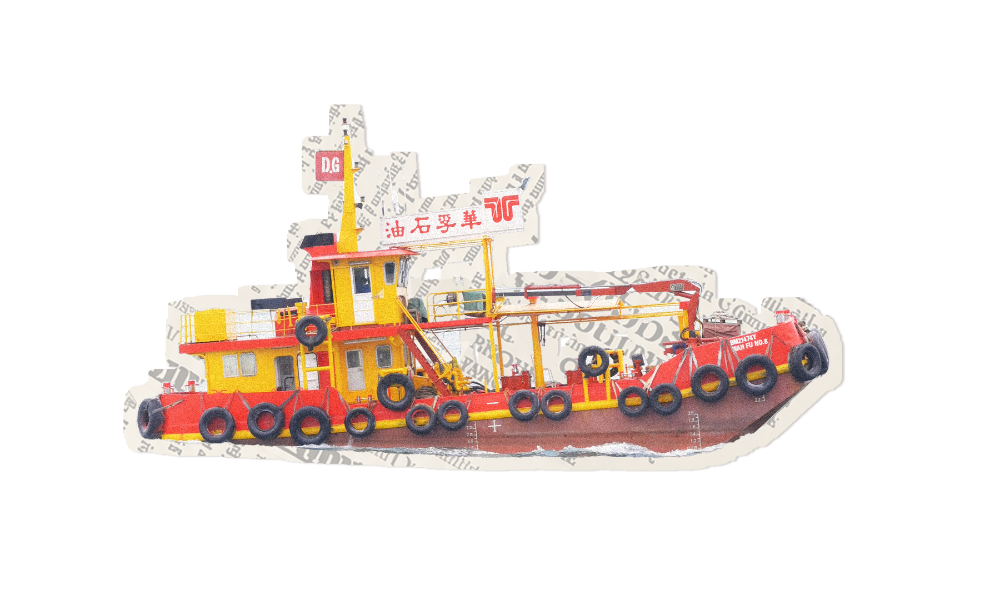

万物皆可拼贴生成器

这是一个我为本地创作场景慢慢打磨出来的拼贴工具。
它适合把照片、街头素材、透明 PNG 元素重新组合成带一点杂志感、海报感和手工拼贴气息的画面。

![拼贴系统预览]


## 你可以拿它做什么

- 在本地网页里直接上传 PNG / JPG / HEIC 图片，一边看一边调整画面
- 把一组透明 PNG 快速整理成统一风格的拼贴成品
- 借助内置纸张肌理、排版布局和风格资源，让画面更接近真实拼贴
- 以离线方式启动，适合平时随手打开就开始做图

## 功能一眼看懂

### 1. 本地网页拼贴工作台

如果你更喜欢边看边改，这会是最顺手的入口。
上传图片之后，可以直接观察整体排版，再慢慢把画面调到自己想要的感觉。

![网页拼贴工作台]


### 2. 拼贴效果示例

我更希望它不是只会把图拼在一起，而是真的能帮你做出有氛围、有气质的画面。
它比较适合杂志感封面、街头海报、复古拼贴和情绪板这一类有明显视觉情绪的内容。

| 城市场景 | 街头海报 |
| --- | --- |
|  |  |

| 船只主题 | 招牌主题 |
| --- | --- |
|  |  |

### 3. 内置纸张与风格资源

这个系统不是简单把图片贴上去。
我把纸张纹理、拼贴布局和视觉风格都放进来了，所以最后做出来的结果，会更接近真实的手工拼贴，而不是单纯堆图。

## 适合什么场景

- 做小红书封面、公众号配图、海报封面这类需要第一眼抓住注意力的视觉图
- 把旅行照、街拍、旧照片或零散素材整理成一组有统一气质的拼贴作品
- 做情绪板、灵感板、版式练习，或者把喜欢的图片重新做成一张新的画面
- 在正式开始内容创作前，先快速试几种风格方向，找到更喜欢的视觉感觉

## 推荐起手方式

`collage_tool/` 是当前项目的唯一建议进入点。

如果你是第一次打开这个项目，建议先把它当成一个创作工具来看，而不只是一个代码目录。
从这里进入，会更容易理解整个系统是怎么组织起来的。

先看：

- `collage_tool/README.md`
- `collage_tool/INDEX.md`

## 快速启动

日常离线使用：

```bash
open launchers/mac/启动拼贴系统.command
```

Windows 双击使用：

```bat
启动拼贴系统.bat
```

实际双击入口：

- `启动拼贴系统.bat`
- `launchers/mac/启动拼贴系统.command`
- `launchers/windows/启动拼贴系统.bat`
- `tools/launch_collage_web.py`

开发态网页模式：

```bash
/Users/lipeng/.cache/codex-runtimes/codex-primary-runtime/dependencies/python/bin/python3 tools/launch_collage_web.py
```

兼容 CLI 网页模式：

```bash
/Users/lipeng/.cache/codex-runtimes/codex-primary-runtime/dependencies/python/bin/python3 collage_tool/run_collage_tool.py web
```

批处理模式：

```bash
/Users/lipeng/.cache/codex-runtimes/codex-primary-runtime/dependencies/python/bin/python3 collage_tool/run_collage_tool.py batch --input-dir /absolute/path --template print-warm
```

## 核心目录

- `work/collage_batch`：模板与渲染管线
- `work/collage_web`：网页服务与静态资源
- `launchers/`：离线双击入口与宿主层说明
- `tools/launch_collage_web.py`：离线网页启动编排器
- `collage_tool/`：聚合入口、对接文档与迭代导航

## 当前支持

- 透明 PNG 批量处理拼贴
- 上传 PNG / JPG / HEIC 图片的本地网页工具
